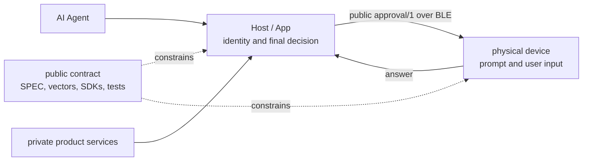

# Build on the Nexting Devices foundation

This guide explains the public foundation behind physical control surfaces for AI agents. It tells you what each layer owns, which file to change, and how a private or third-party product can consume the same public contract.

For exact BLE UUIDs, message fields, byte limits, and state transitions, [the protocol specification](../SPEC.md) is normative. This guide explains why the layers exist and where their implementations live.

## The product boundary

A Nexting device shows one pending approval, accepts a real user's Allow or Deny input, and reports that input to a trusted Host. The Host verifies the device, request, expiry, duplicate state, and phone/device race before it asks the Agent to act.



The device talks to the Host over BLE; the Host may reach the agent anywhere — across the room or across the internet through its own private services. The public contract ends at the BLE link, so every compatible device is remote-capable by construction: whatever the Host can reach, the device can control.

The device does not receive Agent credentials, internal session identifiers, cloud routes, or account data. Experimental 0.2 does not define a public cloud API, TCP/UDP port, MQTT topic, or device-to-Agent connection. Private services can create an internal prompt, but their device integration must pass through the public Host contract.

Two identity tiers share this contract. Nexting first-party products carry production identity and the full capability set. Third-party and DIY devices use the same protocol but require explicit, revocable user authorization in the Host, and are labeled as third-party.

## One approval lifecycle

1. The private or third-party Host creates an opaque public request ID, a minimum necessary summary, and a relative TTL.
2. The Host verifies that the connected peripheral is enrolled and supports wire version 1 plus profile `approval/1`.
3. The Host sends `present`. A successful enqueue, not an attempted call, marks the request as presented.
4. The device enters Pending and exposes exactly two local actions: Allow and Deny.
5. The first valid local action locks the choice. The device sends `answer` and cannot switch choices while retrying.
6. The Host rejects unauthorized, stale, expired, duplicate, unknown, or racing answers.
7. The Host calls its existing Agent answer path. Only an authoritative success finishes the approval.
8. The Host sends `resolved` for answered, expired, cancelled, or replaced requests. Disconnect and reboot clear device-side volatile approval state.

## Dependency direction

```text
SPEC.md + protocol/vectors/approval-v1.json
                   |
          readable JS reference
             /             \
      Swift Host SDK    portable C99 core
            |                 |
     CoreBluetooth       Zephyr adapters
            |                 |
   private/third-party     reference and
        Host products    third-party devices
```

Specifications and vectors flow down into implementations. Platform adapters never become a second protocol source. Public code never imports private App, Mac Bridge, cloud, production-firmware, identity, OTA, or manufacturing files.

## Normative and reference files

| File                                | Owns                                                       |
| ----------------------------------- | ---------------------------------------------------------- |
| `SPEC.md`                           | BLE roles, wire behavior, state, limits, and version rules |
| `protocol/vectors/approval-v1.json` | Shared valid and hostile cases for every implementation    |
| `schemas/message.schema.json`       | Machine-readable message shape and enums                   |
| `reference/js/src/protocol.mjs`     | Readable strict codec reference                            |
| `reference/js/src/framing.mjs`      | Bounded newline stream reference                           |
| `reference/js/src/relay.mjs`        | Host-authoritative one-prompt reference state              |

The schema describes shape, but UTF-8 byte ceilings and stream behavior remain normative in `SPEC.md` and the shared vectors.

## Host SDK files

| File                                                | Owns                                                                               |
| --------------------------------------------------- | ---------------------------------------------------------------------------------- |
| `sdk/swift/Sources/NextingDeviceKit/Protocol.swift` | Public messages and strict encoding/decoding                                       |
| `Framing.swift`                                     | Bounded newline assembly and oversize discard                                      |
| `DeviceInfo.swift`                                  | Peripheral capability parsing and negotiation                                      |
| `Authorization.swift`                               | Stable peripheral identity and deny-by-default authorization                       |
| `Relay.swift`                                       | TTL, replacement, duplicate handling, phone/device races, and two-phase completion |
| `Coordinator.swift`                                 | Thin mapping between product prompt context and the public relay/transport         |
| `State.swift`                                       | Pure answer-claim and discovery-recovery helpers                                   |
| `Central.swift`                                     | CoreBluetooth discovery, encrypted setup, bounded writes, and notification input   |

The Host product supplies enrollment UI, risk policy, internal prompt context, and the final Agent answer call. It calls `present` with a summary and TTL, then reports `answerSucceeded` or `answerFailed` only after its authoritative Agent operation returns.

## Device core and adapter files

| File                                         | Owns                                                                     |
| -------------------------------------------- | ------------------------------------------------------------------------ |
| `sdk/c/include/nexting_device.h`             | Portable C ABI, capacities, messages, stream, and approval state         |
| `sdk/c/src/nexting_device.c`                 | Strict codec, fixed-buffer stream, and approval state machine            |
| `firmware/zephyr/src/main.c`                 | BLE/GATT, bonding, bond reset, GPIO, timers, and fixed transport buffers |
| `firmware/zephyr/boards/*.overlay`           | Board-specific Allow, Deny, and Pending pin aliases                      |
| `examples/macos-device-simulator/main.swift` | Real BLE peripheral reference without a physical board                   |

A new RTOS or MCU adapter reuses the C core. It implements BLE transport, a monotonic millisecond clock, two unambiguous inputs, a Pending output, encrypted bonding, local bond revocation, and volatile-state cleanup. It does not copy the JSON parser or approval state machine.

## Fail closed

Malformed, oversized, invalid UTF-8, unknown-version, unauthorized, stale, expired, duplicate, or choice-changing input must not approve an action. Queue or Bluetooth backpressure must not mark an unsent prompt as presented. Disconnect, unsubscribe, reboot, and expiry clear actionable device state.

Build success proves compilation only. It does not prove Bluetooth delivery, bonding, revocation, race behavior, buttons, LEDs, or product security.

## What to change

| Change                            | Start here                              | Then update                                | Minimum evidence                               |
| --------------------------------- | --------------------------------------- | ------------------------------------------ | ---------------------------------------------- |
| Wire field, enum, limit, or state | `SPEC.md`                               | vectors, JS, Swift, C                      | JS + Swift + C sanitizer suites                |
| Host prompt behavior              | `Relay.swift` / `Coordinator.swift`     | JS reference when semantics change         | Swift tests + consuming Host integration tests |
| CoreBluetooth transport           | `Central.swift`                         | simulator when peripheral behavior changes | Swift + simulator compile                      |
| Device codec or state             | `nexting_device.h` / `nexting_device.c` | vectors and reference behavior             | C ASan/UBSan + firmware contract               |
| Zephyr BLE, bond, timer, or GPIO  | `firmware/zephyr/src/main.c`            | board overlay when pins change             | firmware contract + affected board builds      |
| New chip or RTOS                  | new platform adapter                    | hardware support and implementation track  | core tests + exact target build                |
| Compatibility claim               | conformance evidence                    | project status and changelog               | evidence required by the claimed level         |

## Beyond Experimental 0.2: the capability roadmap

Experimental 0.2 ships two capabilities: profile `approval/1` and profile `status/1`. The platform direction is a full physical control surface — every data form a device maker needs, each as its own versioned profile with its own vectors and evidence, never silently reusing the `approval/1` claim.

The **capability declaration** is the extensibility mechanism: on connect, a
device can report typed identity, buttons, rotary controls, display, haptics,
standard battery support, and bounded inert vendor facts. The Host shows only
fields the device actually declares. Interactive key events, navigation,
microphone, lighting, and configuration still need their own profiles rather
than being inferred from static metadata.

The roadmap, modeled on the complete feature set of dedicated agent macropads:

| Capability                        | Direction     | Product meaning                                                                                                   |
| --------------------------------- | ------------- | ----------------------------------------------------------------------------------------------------------------- |
| `approval/1` (shipped)            | both          | One Allow/Deny request with TTL                                                                                   |
| `status/1` (shipped)              | Host → device | Per-agent idle/thinking/working/complete/needs-input/error states for LEDs or screens, full replacement, volatile |
| Command keys                      | device → Host | Physical key events (approve, decline, fork, mic, send, fast); the Host owns what each key means                  |
| Navigation input                  | device → Host | Stick direction events for radial menus and workflow selection                                                    |
| Rotary input                      | both          | Dial events up; level lists and current level down                                                                |
| Text content                      | Host → device | Summaries and conversation content for screened devices                                                           |
| Voice                             | device → Host | Push-to-talk control, with device-microphone audio or Host-microphone capture                                     |
| Configuration                     | Host → device | Key maps and lighting, so behavior changes without reflashing                                                     |
| Battery and device info (shipped) | device → Host | Identity, capabilities, limits, and charge state                                                                  |

Wi-Fi, HTTP, MQTT, USB HID, persistent permission grants, multi-prompt queues, production device certificates, OTA signing, manufacturing provisioning, and the Nexting Compatible badge still require explicit future contracts.

Continue with [the public interface catalog](interfaces.md), [an implementation track](implementation-tracks.md), or [the conformance rules](conformance.md).
